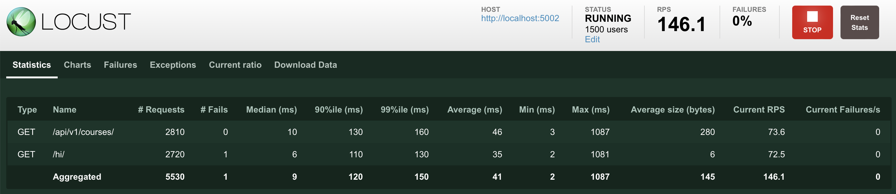

[Deploy проекта](deploy/)

### Состав микросервисов

1. [**binance_service**](services/binance_service/)
   - Работает с апи бинанса через вебсокет.
   - Работает не стабильно не всегда возвращает все валютные пары

2. [**coingeko_service**](services/coingeko_service/)
   - Работает с апи coingeko
   - Не всегда возвращает все валютные пары из-за ограничения публичного апи

3. [**courses_service**](services/courses_service/)
   - Получает данные из binance_service и coingeko_service

## Нагрузочный тест проект
